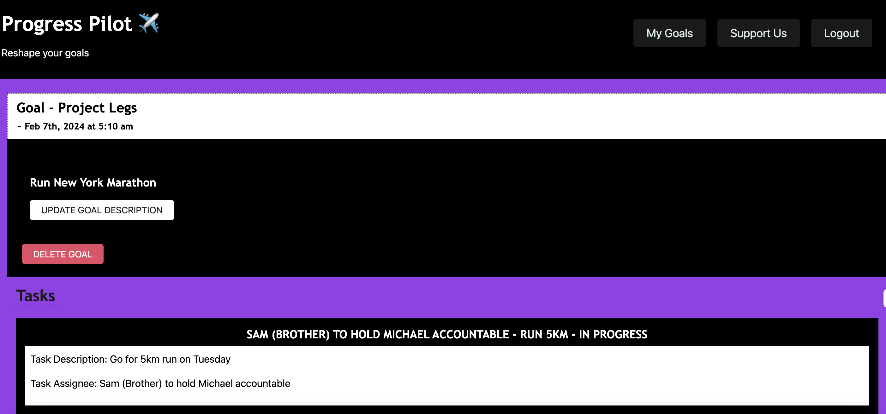
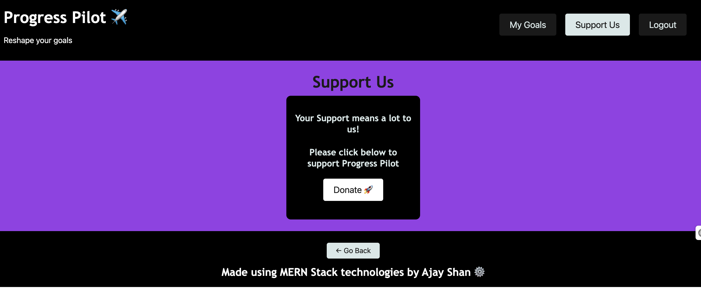

# Progress Pilot ✈️

## Description
"New Year, New Me" - a phrase often used at the start of the new but rarely kept to. Progress Pilot is a collaborative, task-based goal tracker that will help you track and reach your goals! This project is a full stack MERN application that makes use of MongoDB, Express, React, Node as well as Mongoose ODM, CSS, Semantic UI and JWT Authentication. Wireframe design for website made use of Figma.

## Credits
App.css style for CSS styling conversions makes use of 'normalize.css v8.0.1 | MIT License | github.com/necolas/normalize.css' from [Nicolas Gallagher](https://github.com/necolas)

## Web Application Preview

## Relevant Links
- [Deployed Application](https://progress-pilot.onrender.com/)
- [GitHub Repo](https://github.com/ajayshans/progress-pilot)